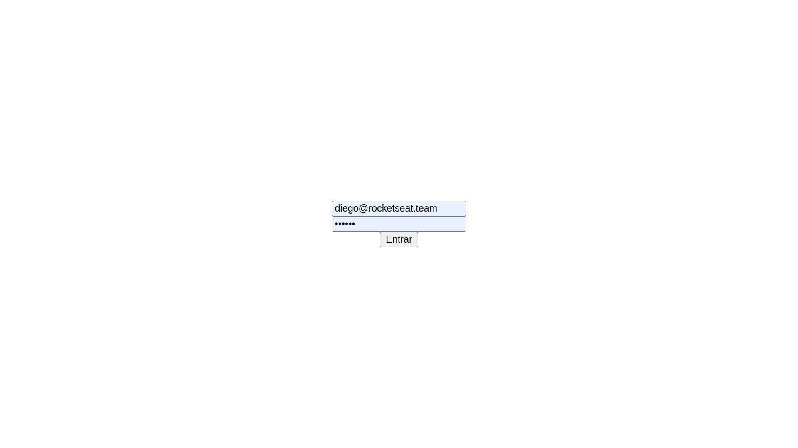

<div>
  <h1 align="center"> 
    Nextauth
  </h1>
  <h2 align="center"> 
    Authentication and Authorization 
  <h3 align="center"> 
    Module 4 - RocketSeat - Ignite ReactJS  🔥
  </h2>
  </h3>

  <p align="center">
    <a href="https://rocketseat.com.br">
      
    </a>
    <a href="https://github.com/jorgeeder"> 
      
    </a>
    
    
    <a href="https://opensource.org/licenses/MIT">
      
    </a>
  </p>
</div>

## About The Project

project created with next to study and implement jwt authentication


## Features

- Login
- Create token
- Create refresh token
- Logout


## Technologies

-   **[Next](https://nextjs.org/)**


## Application in Use




## Requirement

-   **[Node.js](https://nodejs.org/)**
-   **[Next](https://nextjs.org/)**
-   **[API Backend](https://github.com/jorgeeder/ignite-reactjs-auth-backend)**


## Running The Project

```
# Clone Authentication Backend 
git clone https://github.com/jorgeeder/ignite-reactjs-auth-backend

## Access the project folder in the terminal
cd ignite-reactjs-auth-backend

## Install dependencies 
yarn

## Start Server
yarn dev


# Clone this repository
git clone https://github.com/jorgeeder/nextauth

## Access the project folder in the terminal
cd nextauth

## Install dependencies 
yarn

## Start Server
yarn dev

```
## License

This project is under the MIT license. See the [LICENSE](/LICENSE) file for more details.


<div align="center">
  <p> Made with 💜 by <a href="https://github.com/jorgeeder">Jorge Eder</a> </p>
  <p>
    <a href="https://www.linkedin.com/in/jorgeeder/">
      
    </a>
    <a href = "mailto:jorgeeder.dev@gmail.com">
      
    </a>
  </p>
</div>